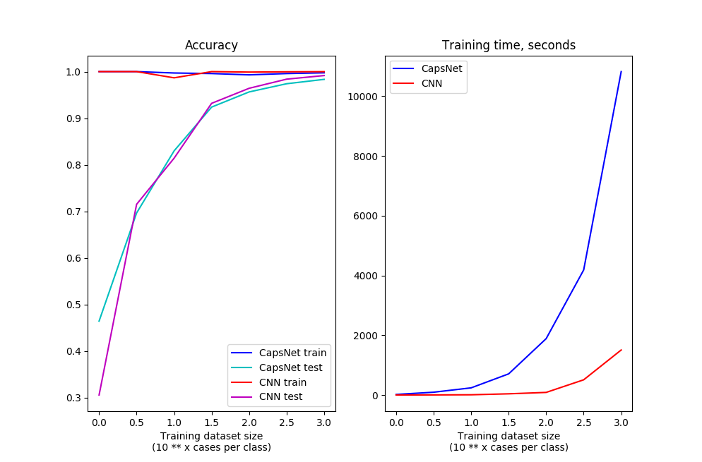

# Are capsule networks really better than convolutional networks with max pooling?

Geoffrey Hinton claims that CNNs with max pooling are [wrong](https://www.youtube.com/watch?v=rTawFwUvnLE), while capsule networks are [very promising](https://www.youtube.com/watch?v=6S1_WqE55UQ).

In [paper](https://arxiv.org/pdf/1710.09829.pdf) they train capsule network to classify highly overlapping MNIST digits and get pretty impressive results.

There also is a mention (both in paper and in talks) that due to grabbing the manifold behind raw pixels capsule networks will need less data to train. This is the assumption tested here

## Boring details about this implementation of CapsNet

It is based on original paper, but with few differences:

- It is scaled down to have ~1 M params (original net has ~7M params) to **have same number of params as reference CNN**
- As far as we are not interested in detecting several digits on same image, offered "margin loss" is replaced with default cross-entropy loss
- Reconstruction loss and reconstruction sub-network are removed altogether - looks like it does not provide any performance boost
- "Reduce learning rate on plateau" and "early stopping" tricks are applied instead of just using fixed number of epochs and TF Adam with default params

Kudos to @ageron and his [TensorFlow CapsNet implementation](https://github.com/ageron/handson-ml/blob/master/extra_capsnets.ipynb), as well as [videotutorial](https://www.youtube.com/watch?v=2Kawrd5szHE)

## Results

So here is the comparison of CapsNet vs straightforward CNN, both having ~1M parameters. Testing done on MNIST dataset

Inference time is not shown, but it is constant for both models, 50x more for CapsNet than for CNN

My reading of this data is as following:

 - If you have **very** small dataset (up to 3 cases per class for MNIST, probably more in more complex settings) you indeed can get decent performance edge over CNN by using CapsNet
 - This will cost you ~10X slower training and ~50x slower inference
 - With dataset growth CapsNet advantage evaporates and CNN even starts performing *better* (while keeping performance superiority)

## DIY

So is Geoffrey Hinton really wrong and some nameless guy from GitHub right? Maybe not.

You are welcome to hack things around and hopefully improve my CapsNet implementation.

You are doubly welcome to let me know if you succeed.

